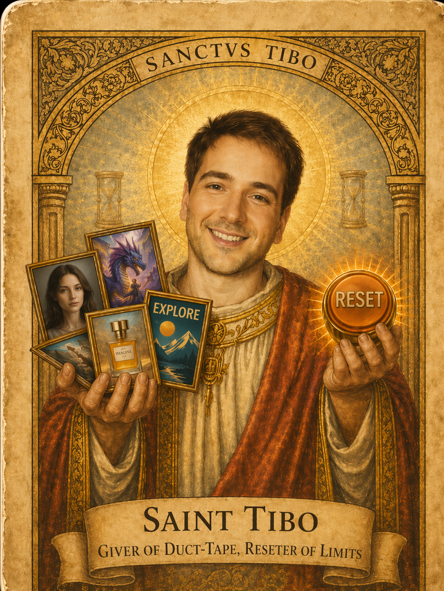
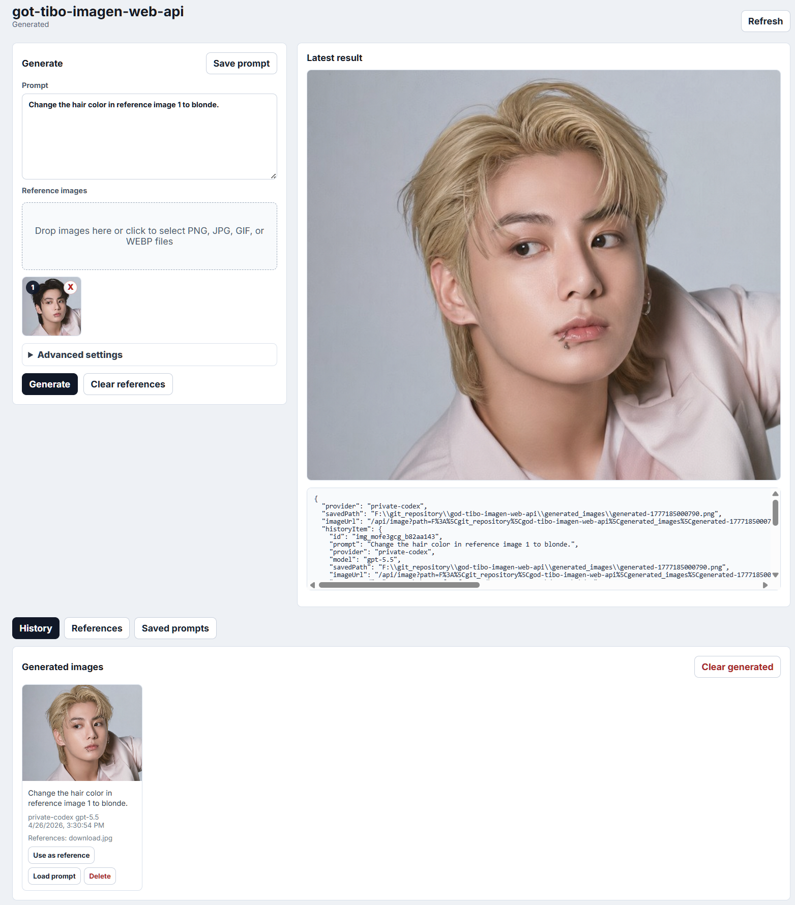

<p align="center">
  
</p>

# got-tibo-imagen-web-api

Node.js library and CLI for sending image-generation requests to Codex's private ChatGPT-authenticated backend path.

This project is based on [NomaDamas/god-tibo-imagen](https://github.com/NomaDamas/god-tibo-imagen) and extends it with a local web UI, reusable reference images, generation history, saved prompts, and local API conveniences.

> WARNING: This is **not** a supported public API integration. It depends on private Codex request behavior that may change without notice.

<p align="center">
  
</p>

## Changes in this web API repo

- Adds a local HTTP server with a small browser UI via `gti-serve` or `npm run serve`
- Exposes `POST /api/generate` for image generation and `GET /api/image?path=...` for viewing generated files
- Saves default server-generated images under `generated_images/` instead of the repository root
- Adds browser-only history, saved prompts, drag-and-drop reference images, and previous-image reuse without a database
- Saves uploaded reference images in a reusable local reference library
- Keeps the existing Node CLI/library and Python SDK behavior available

## What it does

- Reuses local Codex ChatGPT auth from `~/.codex/auth.json`
- Reads `~/.codex/installation_id` when available
- Sends a `POST` request to `https://chatgpt.com/backend-api/codex/responses`
- Requests the built-in `image_generation` tool with `output_format: png`
- Parses streamed SSE output and saves the resulting PNG
- Supports dry-run and sanitized debug dumps with request/response metadata minimization
- Also supports a `codex exec` fallback provider that verifies real PNG output from `~/.codex/generated_images/`

## Requirements

- Node.js 20+
- Existing local Codex ChatGPT login state
- A Codex/ChatGPT account that is entitled to image generation on the private backend

## Installation Guide

### Prerequisites

- **Node.js 20+** (for CLI and Node.js library)
- **Python 3.10+** (for Python SDK)
- Existing local Codex ChatGPT login state (`~/.codex/auth.json`)
- A Codex/ChatGPT account entitled to image generation on the private backend

### CLI (global)

```bash
npm install -g god-tibo-imagen
```

After installation, the `gti` command is available globally:

```bash
gti --version
gti --help
```

### Node.js Library

```bash
npm install god-tibo-imagen
```

```javascript
import { createProvider, resolveConfig } from 'god-tibo-imagen';
```

### Python SDK

```bash
pip install god-tibo-imagen
```

```python
from gti import Client
```

---

## CLI Usage

```bash
npm test
npm run check
gti --prompt "flat blue square icon" --output ./out/blue-square.png
```

### Image input

You can provide existing images as additional context alongside your text prompt. Images are embedded as base64 data URLs and sent with the request. Use `--image` multiple times for multiple images.

```bash
# single image
gti --prompt "Make this cat wear a hat" --image ./cat.png --output ./cat-hat.png

# multiple images
gti --prompt "Combine these two styles" --image ./style-a.png --image ./style-b.png --output ./combined.png
```

Supported formats: `png`, `jpg`/`jpeg`, `gif`, `webp`.

### Provider modes

```bash
# direct private HTTP path
gti --provider private-codex --prompt "flat blue square icon" --output ./out.png

# borrow the Hermes-style codex exec workaround
gti --provider codex-cli --prompt "flat blue square icon" --output ./out.png

# try private HTTP first, then fall back to codex-cli
gti --provider auto --prompt "flat blue square icon" --output ./out.png
```

### Dry run

```bash
gti --prompt "flat blue square icon" --dry-run
```

### Live smoke test

```bash
npm run smoke:live -- "Generate a tiny flat blue square icon." ./smoke-output.png
```

## Web/API Server

This package can also run as a small local HTTP service. The server wraps the same providers used by the CLI.

```bash
npm run serve
# or, after global install:
gti-serve --host 127.0.0.1 --port 8787
```

Endpoints:

- `GET /` — simple browser UI
- `GET /health` — health check
- `POST /api/generate` — generate an image
- `GET /api/image?path=...` — serve generated images from this project directory for the browser viewer

Additional browser convenience endpoints:

- `GET /api/history` - list generated image history
- `GET /api/image-data?id=...` - load a generated image as a reference-image data URL
- `DELETE /api/history/:id` - delete a generated image history entry and its local generated file when safe
- `GET /api/prompts` - list saved prompts
- `POST /api/prompts` - save a reusable prompt
- `DELETE /api/prompts/:id` - delete a saved prompt
- `GET /api/references` - list uploaded reference images
- `POST /api/references` - save an uploaded reference image
- `GET /api/reference-data?id=...` - load a saved reference image as a data URL
- `DELETE /api/references/:id` - delete a saved reference image

Example API call:

```bash
curl -X POST http://127.0.0.1:8787/api/generate \
  -H "content-type: application/json" \
  -d '{"prompt":"flat blue square icon","provider":"auto","outputPath":"./out.png"}'
```

The server still depends on the same local Codex ChatGPT auth state and unsupported private backend behavior as the CLI.
The browser UI shows the generated image when the saved output path is inside the project directory.
When `outputPath` is omitted, generated PNG files are saved under `generated_images/` instead of the repository root.
The web UI stores local history in `generated_images/index.json` and saved prompts in `generated_images/prompts.json`.
Uploaded reference images are stored under `generated_images/references/` with metadata in `generated_images/references.json`.

## Programmatic API (Node.js)

```javascript
import { createProvider, resolveConfig, loadCodexSession, validateCodexSession } from 'god-tibo-imagen';

const config = resolveConfig({ provider: 'private-codex' });
const provider = createProvider(config);

const result = await provider.generateImage({
  prompt: 'flat blue square icon',
  model: 'gpt-5.5',
  outputPath: './out.png',
  dryRun: false,
  debug: false
});

console.log(result.savedPath);
```

You can also pass existing images as input:

```javascript
// single image
const result = await provider.generateImage({
  prompt: 'Make this cat wear a hat',
  model: 'gpt-5.5',
  outputPath: './cat-hat.png',
  images: ['data:image/png;base64,iVBORw0KGgo...']
});

// multiple images
const result = await provider.generateImage({
  prompt: 'Combine these two styles',
  model: 'gpt-5.5',
  outputPath: './combined.png',
  images: [
    'data:image/png;base64,abc...',
    'data:image/png;base64,def...'
  ]
});
```

## Python SDK

```python
from gti import Client

client = Client(provider="private-codex")
result = client.generate_image(
    prompt="flat blue square icon",
    model="gpt-5.5",
    output_path="./out.png"
)
print(result.saved_path)
```

You can also pass existing images as input:

```python
# single image
result = client.generate_image(
    prompt="Make this cat wear a hat",
    model="gpt-5.5",
    output_path="./cat-hat.png",
    image_paths="./cat.png"
)

# multiple images
result = client.generate_image(
    prompt="Combine these two styles",
    model="gpt-5.5",
    output_path="./combined.png",
    image_paths=["./style-a.png", "./style-b.png"]
)
```


## Quick Start

### 1. Generate an image via CLI

```bash
gti --prompt "flat blue square icon" --output ./out.png
```

### 2. Use in a Node.js script

```javascript
import { createProvider, resolveConfig } from 'god-tibo-imagen';

const config = resolveConfig({ provider: 'private-codex' });
const provider = createProvider(config);

const result = await provider.generateImage({
  prompt: 'flat blue square icon',
  model: 'gpt-5.5',
  outputPath: './out.png',
});

console.log(result.savedPath);
```

### 3. Use in a Python script

```python
from gti import Client

client = Client(provider="private-codex")
result = client.generate_image(
    prompt="flat blue square icon",
    model="gpt-5.5",
    output_path="./out.png"
)
print(result.saved_path)
```

With image inputs:

```python
result = client.generate_image(
    prompt="Make this cat wear a hat",
    model="gpt-5.5",
    output_path="./cat-hat.png",
    image_paths="./cat.png"
)
print(result.saved_path)
```

## Key files

- `src/auth/loadCodexSession.js` — reads Codex auth state
- `src/auth/validateSession.js` — validates required private-backend fields
- `src/codex/buildResponsesRequest.js` — builds the `/responses` request
- `src/codex/streamResponsesSse.js` — parses SSE events
- `src/codex/extractImageGeneration.js` — finds `image_generation_call`
- `src/providers/privateCodexProvider.js` — live request/response orchestration
- `src/providers/codexCliProvider.js` — Hermes-style `codex exec` fallback with file verification
- `src/providers/createProvider.js` — provider selection and auto fallback
- `src/cli/generate.js` — CLI entry point

## Notes

- This MVP supports the file-backed `~/.codex/auth.json` path.
- If your Codex install stores auth only in a keyring and does not materialize `auth.json`, this MVP will not discover it yet.
- Debug dumps redact bearer tokens, account/session identifiers, installation IDs, cookies, and image payload base64, and store a minimized response summary instead of the raw response body.
- The architecture now supports both the direct private HTTP client and a Hermes-style `codex exec` fallback, while keeping the provider seam open for future `app-server` integration.
